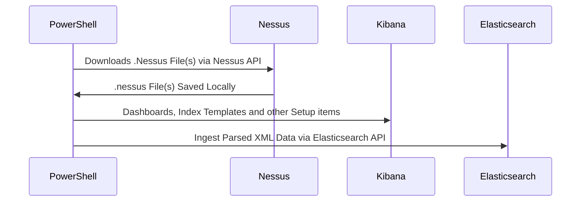

# ⚡Power-Nessie🦕

Ingest .nessus files from Tenable's Nessus scanner  into ElasticSearch.

#### ❔ Why the new repo?
This project has taken on it's own form due to the major changes from the original work: [iwikmai/Nessus-ES](https://github.com/iwikmai/Nessus-ES). A huge thanks to the original creator of Nessus-ES as it has given me the foundation to begin learning how to ingest data into the Elastic stack programmatically. Thank you! 

The old project that I had forked and made mayn changes to is now read-only and will eventually be deleted [nicpenning/Nessus-ES](https://github.com/nicpenning/Nessus-ES). 

This new project comes with some new changes such as bug fixes, pipeline/mapping updates, and the new ability to do patch summary from previously ingested Nessus scan data.

#### ⚡Power-Nessie🦕
A way to ingest Nessus Scan data into Elasticsearch using PowerShell. Tracking vulnerabilities can be scary and overwhelming but this tool is designed to wrangle up those vulnerabilities into manageable way.

As always, feel free to post issues / questions in this project to make it even better. Enjoy!

With some careful setup of your Elastic stack and a little PowerShell you can turn your .nessus files into this:

The Power-Nessie project is a simplified way of taking .nessus files and ingesting them into Elastic using PowerShell on Windows, Mac, or Linux.

Requirements
* Functioning Elastic Stack (7.0+, 8.12.1 Latest Tested)
* PowerShell 7.0+ (7.4.1 Latest Tested)
* .nessus File(s) Exported (Script included to export these files!)

Script includes a Menu to help you through how you would like to use this tool:

## Now
- [X] Index Template (How To)
- [X] Index Pattern, Searches, Visualizations, and Dashboards
- [X] ECS coverage across as many fields as possible
- [ ] Documentation ([Wiki](https://github.com/nicpenning/Power-Nessie/wiki/Overview))
- [X] Automated Nessus File Download Script
- [X] Automated Elasticsearch Ingest
- [X] Setup Script (Template, Objects, API, etc..)

## Future
- [ ] Add Detection Rules
- [ ] Compare Scans (New Data Stream)
- [ ] Automate/Implement Latest CISA KEVs ([Feature Request](https://github.com/nicpenning/Nessus-ES/issues/13))

## Automated or Manual Download and Ingest capability - Check the [Wiki](https://github.com/nicpenning/Power-Nessie/wiki/Overview)!
Invoke-Power-Nessie.ps1

## Full dashboard preview
https://github.com/nicpenning/Power-Nessie/assets/5582679/8fcc5db3-7f28-4410-b796-6d89f339bf6b
