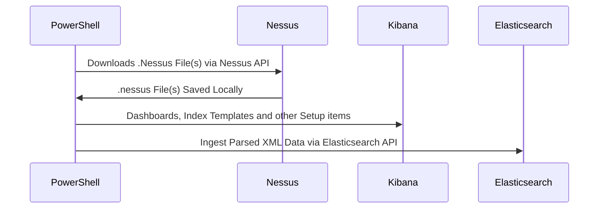
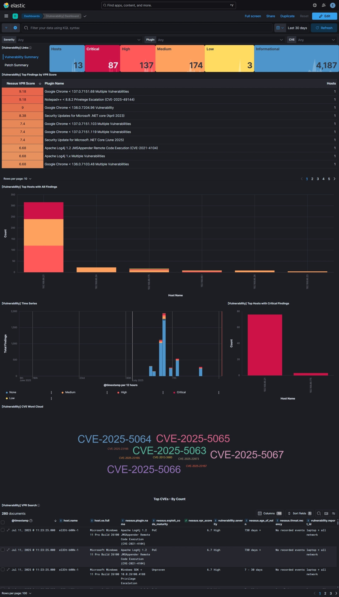
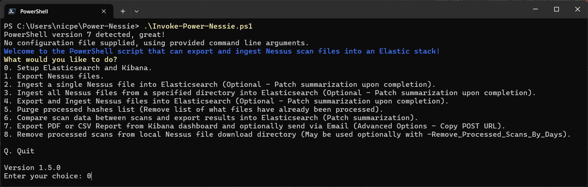
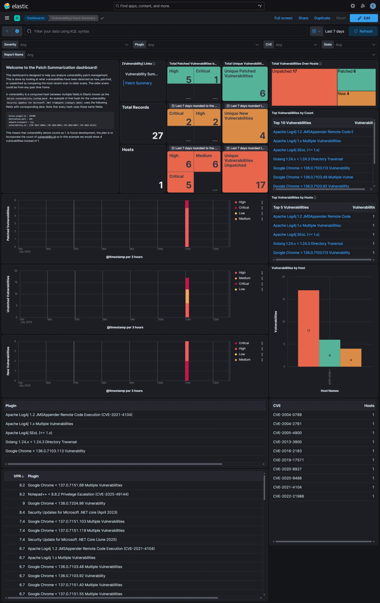
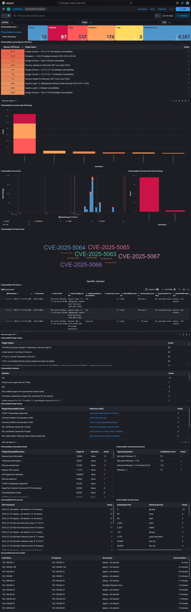

# ⚡Power-Nessie🦕


Ingest .nessus files from Tenable's Nessus scanner  into Elasticsearch.

#### ❔ Why the new repo?
This project has taken on it's own form due to the major changes from the original work: [iwikmai/Nessus-ES](https://github.com/iwikmai/Nessus-ES). A huge thanks to the original creator of Nessus-ES as it has given me the foundation to begin learning how to ingest data into the Elastic stack programmatically. Thank you! 

The old project that I had forked and made my changes to is now archived/read-only and may eventually be deleted [nicpenning/Nessus-ES](https://github.com/nicpenning/Nessus-ES). 

This new project comes with some new changes such as bug fixes, pipeline/mapping updates, and the new ability to do a patch summary from previously ingested Nessus scan data that contain the same hosts.

#### ⚡Power-Nessie🦕
A way to ingest Nessus Scan data into Elasticsearch using PowerShell. Tracking vulnerabilities can be scary and overwhelming but this tool is designed to wrangle up those vulnerabilities into a manageable way.

As always, feel free to post issues / questions in this project to make it even better. Enjoy!



With some careful setup of your Elastic stack and a little PowerShell, you can turn your *.nessus files into this:



The Power-Nessie project is a simplified way of taking .nessus files and ingesting them into Elasticsearch using PowerShell on Windows, Mac, or Linux.

[Requirements](https://github.com/nicpenning/Power-Nessie/wiki/%F0%9F%93%96-Overview#%EF%B8%8F-requirements)
* Functioning Elastic Stack (7.0+, 8.18.3/9.0.3 Latest Tested)
* PowerShell 7.0+ (7.5.1 Latest Tested)
* .nessus File(s) Exported (Power-Nessie can do this!)

Script includes a Menu to help you  use Power-Nessie:


## Now
- [X] Index Template
- [X] Data View, Searches, Visualizations, and Dashboards
- [X] ECS coverage across as many fields as possible
- [X] Documentation ([Wiki](https://github.com/nicpenning/Power-Nessie/wiki/Overview))
- [X] Automated Nessus File Download
- [X] Automated Elasticsearch Ingest
- [X] Setup Script (Template, Objects, API, etc..)

## New
- [X] Compare Scans (New Data Stream and Dashboard)
- [X] Generate Reports (PDF/PNG) & Send via Email
- [X] Configuration File Support
- [X] 💝 Community, join here: https://teams.live.com/l/community/FBANlP3DgeNDPOagwI

✨ Patch Summary Dashboard:


## Future
- [ ] Add Detection Rules

## Automated or Manual Download and Ingest capability - Check the [Wiki](https://github.com/nicpenning/Power-Nessie/wiki/Overview)!
```Powershell
.\Invoke-Power-Nessie.ps1
```

## Full dashboard preview

